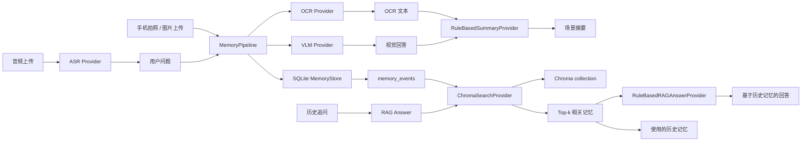

# 系统架构说明

## 当前阶段

当前系统已经从第一版 Web MVP 升级为“视觉记忆 RAG + 非流式语音提问”原型。目标不是只做一次图片问答，而是把每次视觉交互沉淀成可检索的历史记忆，并支持用户继续追问：

```text
鼠标是什么颜色的？
刚才看到的屏幕上是什么项目？
我手上拿过什么东西？
```

## 当前主链路



## 模块职责

- `models/memory.py`：定义视觉记忆事件的数据模型。
- `services/memory_store.py`：负责 SQLite 持久化、时间线读取、删除、裁剪和去重。
- `services/ocr.py`：OCR provider，默认 mock，可切换到 PaddleOCR。
- `services/vlm.py`：VLM provider，默认 mock，可切换到 OpenAI-compatible 多模态接口。
- `services/asr.py`：ASR provider，默认 mock，可切换到 faster-whisper，当前用于非流式音频上传转写。
- `services/summary.py`：把问题、视觉回答和 OCR 文本整理成场景摘要。
- `services/search.py`：历史检索 provider，当前默认 `ChromaSearchProvider`，也保留 lightweight / SQLite vector provider。
- `services/rag.py`：RAG 回答生成层，把召回记忆转成用户可读答案。
- `services/pipeline.py`：串联 ASR 转写、视觉问答、记忆写入、检索和 RAG 问答。
- `api/routes.py`：提供 FastAPI 接口，包括 `/ask`、`/transcribe`、`/memories/search`、`/memories/rag-answer`。
- `ui/streamlit_app.py`：提供 Web demo，包括图片输入、语音提问、记忆时间线、历史检索、历史记忆问答。

## 存储设计

```text
SQLite
└── memory_events
    ├── question
    ├── answer
    ├── scene_summary
    ├── ocr_text
    ├── image_path
    └── latency_ms

Chroma
└── visual_memory collection
    ├── document: question / answer / summary / ocr
    ├── embedding
    └── metadata: memory_id / created_at
```

SQLite 保存完整业务记录，Chroma 保存用于语义召回的 memory document 和 metadata。检索时 Chroma 返回 memory id，再回 SQLite 取完整 `MemoryEvent`。

## RAG 闭环

当前 RAG 问答流程是：

```text
用户历史追问
-> Chroma 检索 top-k memory documents
-> 用 memory_id 回表取完整 MemoryEvent
-> RuleBasedRAGAnswerProvider 生成回答
-> UI 展示回答 + 使用的历史记忆
```

例如：

```text
问题：鼠标是什么颜色的？
回答：根据历史记忆，鼠标主要是黑色的；另外也出现过银灰色的鼠标。
```

这个设计把“向量搜索”升级成完整 RAG：不仅能召回历史记忆，还能把召回结果转成可直接使用的答案。

## 可替换边界

- OCR：`MockOCRProvider` -> `PaddleOCRProvider`
- VLM：`MockVLMProvider` -> `OpenAICompatibleVLMProvider`
- ASR：`MockASRProvider` -> `FasterWhisperASRProvider`
- Search：`LightweightSemanticSearchProvider` / `VectorSearchProvider` / `ChromaSearchProvider`
- Embedding：`HashEmbeddingProvider` -> `SentenceTransformersEmbeddingProvider`
- RAG Answer：`RuleBasedRAGAnswerProvider` 后续可替换为真实 LLM 生成器

## 当前默认配置

```text
AI_GLASSES_SEARCH_PROVIDER=chroma
AI_GLASSES_ASR_PROVIDER=mock
AI_GLASSES_CHROMA_PATH=data/chroma
AI_GLASSES_CHROMA_COLLECTION=visual_memory
AI_GLASSES_EMBEDDING_PROVIDER=hash
```

本地要获得更好的中文语义召回效果，可以切换为：

```text
AI_GLASSES_EMBEDDING_PROVIDER=sentence_transformers
AI_GLASSES_EMBEDDING_MODEL=BAAI/bge-small-zh-v1.5
AI_GLASSES_EMBEDDING_DIMENSIONS=512
```

## 一键验证

运行：

```powershell
.\.venv\Scripts\python.exe scripts\rag_smoke.py
```

预期能看到：

```text
question: 鼠标是什么颜色的？
answer: 根据历史记忆，鼠标主要是黑色的；另外也出现过银灰色的鼠标。
contexts: 2
```
