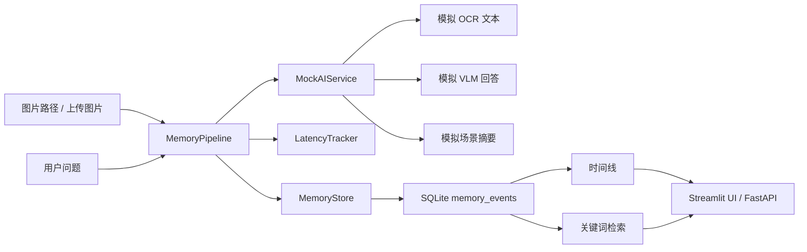

# 系统架构说明

## 当前阶段

第一周只实现系统骨架，不接真实 OCR、ASR、VLM 和向量数据库。目标是先跑通“输入 -> 理解 -> 记忆 -> 展示 -> 检索”的最小闭环。

## 架构图

## 模块职责

- `models/memory.py`：定义 memory event 数据模型。
- `services/memory_store.py`：负责 SQLite 写入、时间线读取和关键词搜索。
- `services/mock_ai.py`：模拟 OCR、VLM 和场景摘要，保证第一周不被模型依赖卡住。
- `services/latency.py`：记录各阶段耗时。
- `services/pipeline.py`：串联一次视觉记忆交互。
- `api/routes.py`：提供 FastAPI 接口。
- `ui/streamlit_app.py`：提供第一版演示界面。

## 后续扩展方式

后续接真实模块时，不应该推翻当前结构，而是在已有接口后替换实现：

- 用真实 OCR 替换 `MockAIService.run_ocr`。
- 用真实 VLM 替换 `MockAIService.answer_question`。
- 增加 ASR 后，把语音转写结果作为 `question` 输入 pipeline。
- 增加 Chroma 或 FAISS 后，让 `MemoryStore` 或新建 `VectorMemoryStore` 同步写入 embedding。
