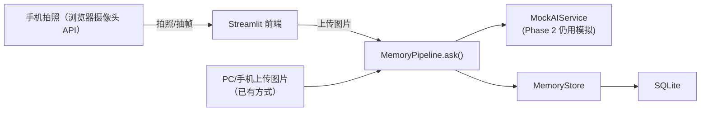

# Phase 2：手机摄像头 —— 模拟眼镜第一视角

## 目标

在 Phase 1 Web MVP 的基础上，增加手机拍照作为图片输入源，模拟 AI 眼镜的第一视角画面输入。

## 方案概述

手机摄像头 → 拍照上传 → 后端接收 → 进入已有 pipeline → 写入记忆 → 前端展示

核心思路：**不改变现有 pipeline 结构，只新增一个输入通道**。pipeline 的 `ask(question, image_path)` 已经接受图片路径，手机拍照只需把上传的图片保存到 `data/uploads/` 然后传入路径即可。

## 架构变更



## 分步实施

### Step 1：Streamlit 增加摄像头输入

**文件：** `src/ai_glasses_memory/ui/streamlit_app.py`

利用 Streamlit 的 `st.camera_input()` 组件，在"当前输入"区域增加一个标签页或并列选项，让用户可以选择：

1. **上传图片**（已有方式，保持不变）
2. **拍照输入**（新增，使用 `st.camera_input`）

`st.camera_input` 返回的数据格式与 `st.file_uploader` 相同（`UploadedFile`），所以 `save_uploaded_file()` 函数可以直接复用。

**伪代码：**

```python
tab1, tab2 = st.tabs(["上传图片", "拍照输入"])

with tab1:
    uploaded_file = st.file_uploader(...)   # 已有代码

with tab2:
    camera_photo = st.camera_input("拍摄一张照片")
```

### Step 2：移动端适配

Streamlit 自带响应式布局，但需要验证在手机浏览器上的实际效果：

- 确认 `st.camera_input` 在 iOS Safari 和 Android Chrome 上可用
- 调整按钮大小和间距，适配触屏操作
- 图片预览保持 `use_container_width=True`

### Step 3：可选增强 —— 连续拍照模式

增加"连续拍照"按钮，每按一次拍一张并自动提交，模拟眼镜的连续帧输入。后端 pipeline 设置为只处理最新图片，不做视频流分析（Phase 2 不涉及真实视频处理）。

### Step 4：验证 & 测试

- 手机浏览器打开 Streamlit 页面
- 点击"拍照输入"标签
- 拍摄一张照片
- 输入问题并提交
- 确认记忆时间线正常展示
- 确认检索功能正常

## 不需要修改的部分

| 模块 | 原因 |
|------|------|
| `services/pipeline.py` | 输入不变，仍是 `question + image_path` |
| `services/mock_ai.py` | Phase 2 继续用模拟 AI |
| `services/memory_store.py` | 存储逻辑不变 |
| `api/routes.py` | FastAPI 接口不变 |
| `models/memory.py` | 数据模型不变 |

## 需要修改的文件

| 文件 | 改动 |
|------|------|
| `src/ai_glasses_memory/ui/streamlit_app.py` | 增加 `st.camera_input` 和标签页切换逻辑 |

## 依赖变更

无需新增依赖。`streamlit>=1.36.0` 已内置 `st.camera_input` 支持。

## 与总路线的关系

```
Phase 1: Web MVP (当前)        ✅ 已完成
Phase 2: 手机摄像头输入          ← 本计划
Phase 3: 真实 OCR / VLM / 向量检索
Phase 4: RK3588 + 摄像头硬件
Phase 5: Demo 视频 + 简历 + 面试准备
Phase 6: 系统学习与总结
```

Phase 2 的产出是：**一个能用手机拍照、上传、提问、保存记忆的 Web 演示**，可以在面试现场用手机打开页面，拍下周围环境直接演示，比"上传图片"更接近眼镜第一视角的真实体验。
