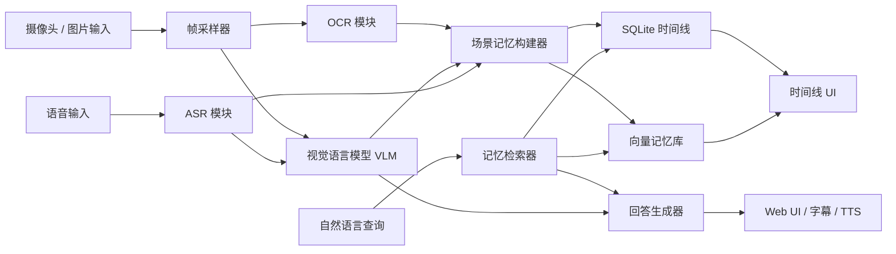

# AI 眼镜实时视觉记忆助手设计文档

日期：2026-05-28

## 1. 项目定位

项目名称：

- AI Glasses Memory Assistant
- AI 眼镜实时视觉记忆助手

这个项目是一个同时面向简历作品集和实习准备的 AI 眼镜系统原型。它不能被包装成简单的“摄像头 + LLM API”小 demo，而应该被设计、实现和讲解成一个可穿戴 AI 原型系统：把视觉输入、语音输入、多模态理解、个人记忆、历史检索和用户反馈串成一条完整链路。

项目有两个同等重要的目标：

1. 做出一个可以放到 GitHub、可以录制 demo、可以在面试中深入讲解的作品集项目。
2. 借助实现过程，系统准备 AI 眼镜、智能硬件、端侧 AI、多模态 LLM 应用工程相关实习。

作品集最终建议采用“1 个主项目 + 1 个辅助项目”的结构：

- 主项目：AI Glasses Memory Assistant
- 辅助项目：Real-time OCR Translation Glasses

主项目用于证明系统级能力，辅助项目用于证明具体落地场景能力。这样比堆 4-5 个小 demo 更容易让面试官看到项目深度。

## 2. 实习准备方向

本项目优先服务两个方向：

- 智能硬件 / AI 眼镜 / 端侧 AI
- 多模态 LLM 应用工程

因此项目实现和文档需要重点体现：

- 实时视觉输入
- 语音交互
- 多模态视觉问答
- 个人记忆构建
- 检索增强回答
- 延迟统计
- 隐私控制
- 清晰的工程模块边界
- 能用于面试复盘的详细文档

这个项目不按“一次性做完 demo”的方式推进，而按“训练营式分阶段项目”推进。每个阶段都要产出可运行代码、详细学习笔记和面试材料。

## 3. 一句话描述

基于摄像头、语音识别、多模态大模型和向量检索，构建面向 AI 眼镜场景的实时视觉问答与个人记忆助手，支持场景理解、OCR、语音交互、历史记忆检索和低延迟响应。

## 4. 核心能力地图

这个 AI 眼镜原型需要覆盖六类核心能力：

- 看见：摄像头或图片输入
- 听见：语音输入和 ASR
- 理解：多模态 VLM 和 OCR
- 记住：结构化时间线和向量记忆库
- 检索：自然语言历史记忆查询
- 回答：Web UI、字幕式文本反馈，后续扩展 TTS

## 5. MVP 范围

第一版应该先做一个依赖风险较低、能跑通核心链路的 MVP。重点不是一开始追求完整硬件形态，而是保证架构清晰、学习价值高、后续容易扩展。

MVP 必须包含：

- 支持图片上传或摄像头截图。
- 支持文本提问。
- 能对当前图片运行 OCR。
- 提供可插拔的 VLM 接口；如果没有配置真实模型，就使用模拟实现。
- 能根据 OCR 和 VLM 输出生成场景摘要。
- 能把每次交互存成 memory event。
- 使用 SQLite 持久化 memory event。
- 提供基础历史记忆检索；第一版可以先用关键词检索，后续升级到 Chroma 或 FAISS。
- Web UI 展示当前图片、回答、OCR 结果、场景摘要和记忆时间线。
- 记录 OCR、VLM、检索和端到端处理耗时。

第一版暂不做：

- 完整流式 ASR。
- 生产级实时视频处理。
- 端侧模型优化。
- 手机 App 打包。
- 真实智能眼镜部署。

这些内容作为 MVP 稳定后的升级方向。

## 6. 加分功能

MVP 稳定后，可以逐步加入：

- faster-whisper ASR。
- TTS 或字幕式回答模式。
- Chroma 或 FAISS 向量检索。
- 基于 embedding 的语义搜索。
- 帧采样策略：
  - 定时采样
  - 用户提问触发采样
  - 场景变化触发采样
- 隐私模式：
  - 暂停记录
  - 不上传图片
  - 敏感内容过滤
- 本地 OCR 和本地 ASR。
- 手机摄像头输入，用来模拟真实眼镜视角。
- OCR 翻译辅助模式。

## 7. 系统架构



## 8. 模块边界

后续实现时，模块要尽量小而清晰。每个模块都应该有明确职责，便于学习、测试和面试讲解。

`input`

- 负责图片上传、摄像头截图，后续扩展手机摄像头输入。

`ocr`

- 提供稳定的 OCR 接口。
- 第一版可以使用 PaddleOCR、EasyOCR，或者在依赖未准备好时使用模拟实现。

`vlm`

- 提供稳定的多模态模型接口。
- 支持模拟实现、云端 VLM、本地 VLM 等不同实现。

`asr`

- 提供语音转文字抽象。
- 当实时麦克风输入还未完成时，先从最小化的音频文件转写能力开始。
- 后续集成 faster-whisper。

`memory`

- 定义 memory event 数据结构。
- 使用 SQLite 存储时间线数据。
- 后续通过 Chroma 或 FAISS 管理向量记忆库。

`pipeline`

- 串联图片输入、OCR、VLM、场景摘要生成、记忆写入、历史检索和延迟记录。

`api`

- 使用 FastAPI 暴露接口，包括图片处理、提问、记忆检索和时间线查询。

`ui`

- 提供 Web UI。
- 第一版优先使用 Streamlit，因为它搭建快、适合学习和演示。
- 如果后续 UI 成为作品集重点，再考虑升级到 React。

`docs`

- 存放设计文档、学习笔记、架构说明、面试材料和简历材料。

## 9. 推荐技术栈

后端：

- Python
- FastAPI
- Pydantic
- SQLite

前端 / UI：

- 第一版使用 Streamlit
- 后续可升级 React

计算机视觉：

- OpenCV
- Pillow

OCR：

- PaddleOCR 或 EasyOCR
- 如果环境依赖暂时阻塞，先使用模拟实现保证主链路推进

ASR：

- faster-whisper

VLM：

- 可插拔接口
- 第一版先使用模拟实现
- 后续接云端或 OpenAI-compatible 多模态模型
- 如果硬件允许，再探索本地模型

记忆与检索：

- SQLite 存结构化时间线
- Chroma 或 FAISS 做向量检索
- 关键词检索作为第一版 fallback

测试：

- pytest

配置：

- `.env`
- 类型化 settings 模块

文档：

- 全部使用 Markdown
- README
- 架构说明
- 详细学习笔记
- 面试材料

## 10. 分阶段训练路线

### 阶段 1：系统骨架

目标：

- 搭建项目结构、FastAPI 服务、Streamlit UI、基础数据模型和最小端到端流程。

学习重点：

- FastAPI 基础
- API 设计
- Pydantic schema
- Streamlit UI 流程
- SQLite 基础
- Python 项目模块化结构

阶段产出：

- 可运行的系统骨架
- 基础 UI
- memory event 数据模型
- 第一篇详细学习笔记

### 阶段 2：视觉输入与 OCR

目标：

- 增加图片上传、摄像头截图、OpenCV 预处理和 OCR。

学习重点：

- OpenCV 图片读取和格式转换
- 图像压缩
- OCR 输入输出格式
- 从真实场景中提取文字

阶段产出：

- OCR 结果展示
- OCR 文本写入 memory event
- 详细 OCR 学习笔记

### 阶段 3：多模态视觉问答

目标：

- 增加 VLM 接口，让用户可以围绕当前图片提问。

学习重点：

- 多模态 prompt 设计
- 图片编码
- 模型接口抽象
- 云端模型与本地模型的取舍
- 模型调用错误处理

阶段产出：

- 当前图片问答能力
- 场景摘要生成能力
- VLM 学习笔记

### 阶段 4：语音交互

目标：

- 增加 ASR，让用户可以通过语音提问。

学习重点：

- 音频输入格式
- faster-whisper 使用方式
- 流式 ASR 与非流式 ASR 的取舍
- 语音交互延迟分析

阶段产出：

- 语音转文字提问流程
- ASR 延迟指标
- 语音交互学习笔记

### 阶段 5：记忆检索

目标：

- 增加历史记忆搜索，支持结构化时间线检索和向量检索。

学习重点：

- memory event 建模
- embedding
- 向量相似度
- Chroma 或 FAISS
- RAG 流程
- 时间线检索与语义检索的区别

阶段产出：

- 自然语言历史记忆搜索
- 时间线 UI
- 向量检索学习笔记
- RAG 面试材料

### 阶段 6：工程包装

目标：

- 增加延迟面板、隐私模式、README、架构图、demo 脚本和简历材料。

学习重点：

- 延迟统计
- 异步任务边界
- 帧采样策略
- 隐私友好的 AI 产品设计
- 技术文档写作
- 面试中如何讲项目

阶段产出：

- 最终 README
- 架构图
- 30 秒 demo 脚本
- 2 分钟 demo 脚本
- 简历 bullet
- 面试讲解稿

## 11. 文档要求

所有项目文档都必须使用 Markdown。

所有文档和展示材料在能用中文的情况下尽量使用中文。英文保留给代码标识符、API 名称、库名、模型名、文件名、命令，以及更通用的英文技术术语。README、学习笔记、架构说明、面试稿、demo 脚本、简历准备材料默认使用中文，方便复习、展示和后续复用。

文档不能和项目决策脱节。学习笔记和展示材料要融合我们在对话中确定的内容，包括：

- 为什么主项目选择 AI Glasses Memory Assistant。
- 为什么作品集采用“1 个主项目 + 1 个辅助项目”，而不是堆很多小 demo。
- 为什么方向定为 AI 眼镜 / 智能硬件 + 多模态 LLM 应用。
- 为什么采用训练营式分阶段项目。
- 哪些功能属于 MVP。
- 哪些功能属于加分项。
- 每个模块为什么有简历价值和面试价值。
- 实现过程中做了哪些技术取舍。

推荐文档结构：

```text
docs/
  notes/
    01-system-skeleton.md
    02-visual-input-and-ocr.md
    03-multimodal-vqa.md
    04-voice-interaction.md
    05-memory-retrieval.md
    06-engineering-packaging.md
  interview/
    resume-bullets.md
    interview-qa.md
    demo-script-30s.md
    demo-script-2min.md
  architecture/
    system-architecture.md
    data-model.md
    pipeline.md
  superpowers/
    specs/
      2026-05-28-ai-glasses-memory-assistant-design.md
```

## 12. 学习笔记模板

每个阶段的学习笔记都使用下面的 Markdown 结构：

```md
# 阶段标题

## 1. 本阶段目标

## 2. 和项目定位的关系

## 3. 我们在对话中确定的设计决策

## 4. 核心概念

## 5. 技术原理

## 6. 工程实现

## 7. 关键代码解读

## 8. 踩坑记录

## 9. 性能与优化

## 10. 面试高频问题

## 11. 简历 bullet 素材

## 12. 后续扩展
```

学习笔记要足够详细，能够支持：

- 面试前复习
- README 写作
- 技术博客写作
- 简历 bullet 提炼
- 面试项目讲解

## 13. 辅助项目

辅助项目名称：

- Real-time OCR Translation Glasses
- AI 眼镜实时 OCR 翻译助手

这个项目可以在主项目 MVP 完成后实现，也可以从主项目的 OCR 模块中自然拆出来。

核心功能：

- 从摄像头或图片中识别文字
- 自动检测源语言
- 翻译成中文
- 在图片旁展示原文和译文
- 支持菜单、路牌、PPT、屏幕和纸质文本

简历价值：

- 容易演示
- 贴近真实 AI 眼镜场景
- 强化 OCR 和多模态应用能力

## 14. 面向简历的最终产出

最终作品集应包含：

- GitHub-ready 项目仓库
- 带架构图的 README
- 30 秒 demo 视频脚本
- 2 分钟 demo 视频脚本
- 技术博客草稿
- 简历项目描述
- 面试讲解稿
- 详细学习笔记

简历项目名示例：

AI Glasses Memory Assistant | AI 眼镜实时视觉记忆助手

技术栈示例：

Python, OpenCV, FastAPI, faster-whisper, PaddleOCR, Multimodal LLM, Chroma/FAISS, SQLite, Streamlit/React

项目描述示例：

构建面向 AI 眼镜场景的实时视觉记忆助手，支持摄像头取流、语音问答、OCR、场景理解、个人记忆检索和低延迟交互。系统将视觉帧、语音转录和场景摘要结构化存储，并通过向量检索支持“刚才看到了什么”“我把物品放在哪里”等自然语言查询。

## 15. 验收标准

项目达到下面标准时，可以认为第一阶段作品集目标成立：

- 用户可以在本地运行应用。
- 用户可以上传图片或使用摄像头截图。
- 系统可以提取 OCR 文本。
- 系统可以对图片进行回答或模拟回答。
- 系统可以存储场景记忆。
- 系统可以通过自然语言检索历史记忆。
- UI 可以展示当前图片、回答、OCR 结果、记忆时间线和延迟数据。
- README 能把项目解释成 AI 眼镜系统原型。
- 学习笔记足够详细，可以用于面试复习。
- 简历 bullet 具体、技术化、经得起追问。

## 16. 已确认的设计决策

本文档记录了目前对话中已经确认的设计决策：

- 使用训练营式分阶段路线。
- 优先服务 AI 眼镜 / 智能硬件 + 多模态 LLM 应用方向。
- 学习笔记要尽量详细。
- 所有文档统一使用 Markdown。
- 文档和展示材料在可行时默认使用中文。
- 学习笔记要融合我们的对话内容和项目取舍。
- 从可控 MVP 开始，不一开始追求完整复杂系统。
